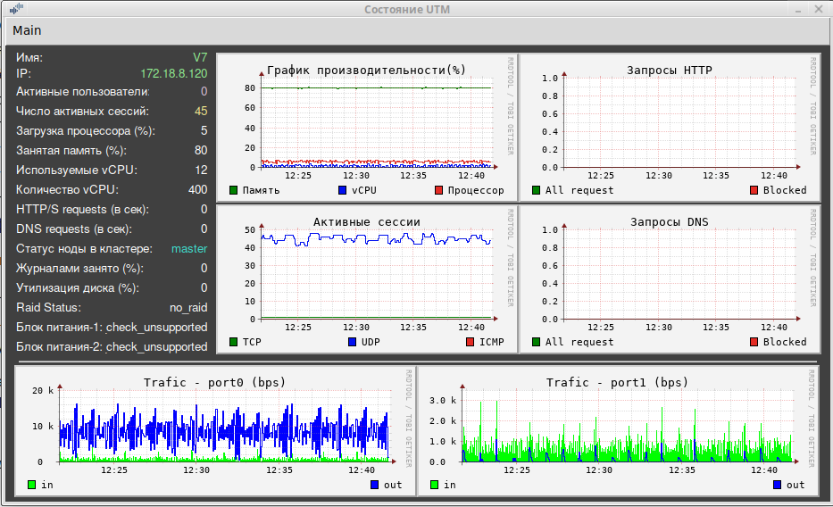

<h2 align="center">Опрос NGFW UserGate версии 7 по SNMP.</h2>
<h3 align="center">(Версия 1.2)</h3>

Программа предназначена для оперативного получения текущего состояния Межсетевого экрана UserGate версии 7.

Программа работает в Ubuntu версии 22.10 или выше. 

Опрос производиться по SNMP c UserGate NGFW версии 7. Выводяться следующие параметры:
- число активных пользователей;
- число активных сессий;
- загрузка процессора;
- занятая оперативноя память;
- число работающих vCPU;
- общее количество vCPU;
- количество HTTP/S запросов в секунду;
- количество DNS запросов в секунду;
- статус ноды в кластере;
- объём дискового пространства занятый журналами;
- утилизация диска;
- состояние массива Raid;
- состояние блоков питания;
- трафик на сетевых интерфейсах.

Установка:
1. Скачать архив <b>ug7_snmp_view.zip</b>, распаковать.
2. Файл <b>ug7_snmp_view</b> сделать исполняемым.
3. Запустить <b>ug7_snmp_view</b>.

После первоначального запуска необходимо в меню "Main" --> "Параметры" открыть окно ввода настроек подключения к NGFW. Необходимо ввести:
- имя устройства,
- IP адрес,
- community.

После этого в меню "Main" --> "Интерфейсы" задать интерфейсы для опроса. 
В "Main" --> "Графики" можно выбрать диапазон графиков: 20 минут, 1 час или 1 день.

Настройки сохраняются в файле ug7_snmp_view.json. Данный файл создаётся в директории программы.

На UTM в разделе "Диагностика и мониторинг" --> "SNMP" в правиле snmp надо поставить версию: "SNMP v2".
На вкладке "События" включить:
- Таблица статистики сетевых интерфейсов;
- Загрузка vCPU;
- Количество vCPU;
- Изменён статус RAID;
- Изменён статус блока питания;
- Высокая загрузка процессора;
- Высокая загрузка памяти;
- Недостаточно места в разделе для журналов;
- Количество лицензий использовано.

Изменения: 
